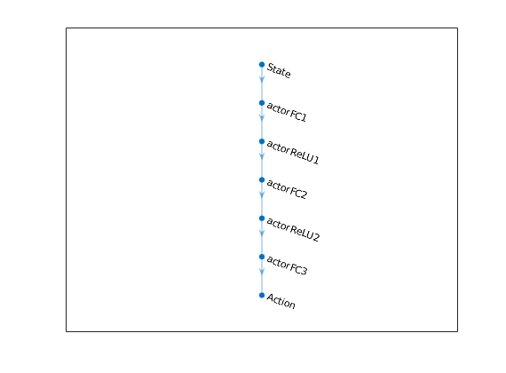
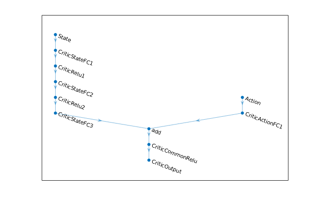
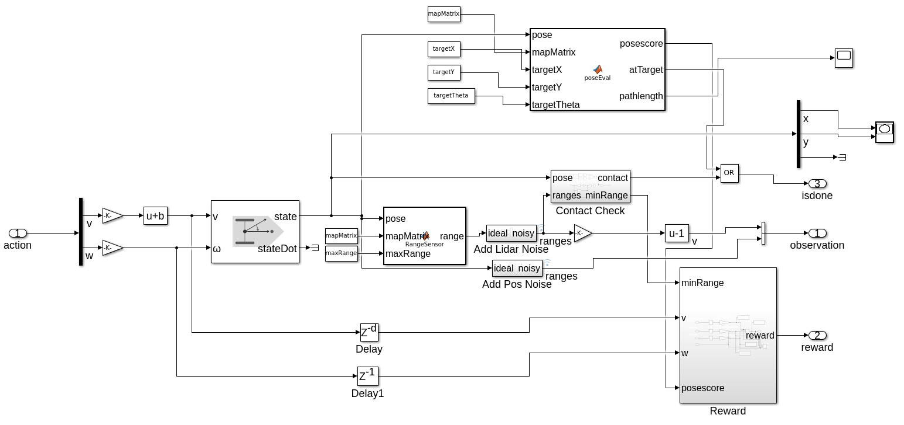
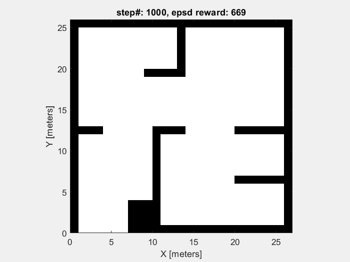

# Mobile Robot Navigation using DDPG

In project [mobile robot collision-avoidance](https://github.com/yangfan/MultiRobotObsAvd), we train the robot to learn a policy to avoid the obstacle in the environment. Although the robot is able to avoid the obstacle, it moves randomly which does not have any useful application in practice. In this project, we extend the model to the mobile robot navigation. Specifically robot should learn a policy to move to a pose in the map.

## Model Overview

Similar to previous project, we use DDPG to train the robot. There are four networks used in the training, i.e.,

(1) Actor network: take observation and return action that maximize cumulative rewards.  
(2) Target actor network: improve the stability of the learning; the parameter is updated slowly.  
(3) Critic network: take observation and action, return action-value.  
(4) Target critic network: improve the stability of the learning; the parameter is updated slowly. 

The structure of the deep neural network used in actor and critic are shown below:




The state in this project includes three continuous variables for pose of robot (i.e., x, y coordinates, orientation) in addition to 7 range sensor readings in collision avoidance project.



Give the action returned by the policy, the `differentialDriveKinematics` model computes the current pose which is received by the `rangeSensor` and `poseEval` functions. `rangeSensor` function returns the sensor readings and `poseEval` function computes the collision-free path length and cosine distance to the goal which are used to evaluate the current pose. Those two functions work as the trainsition function of the environment defined in MDP. 

We define the reward function as:
$$
R = \alpha d^2 + \beta v^2 + \lambda w^2 + f(x,y,\theta)
$$

where $$\alpha, \beta > 0, \lambda<0$$ are coefficients, $$d$$ refers to the minimum distance to the obstacle obtained from the sensor reading, $$v$$ and $$w$$ denote the linear and angular velocity, $$f(x,y,\theta)$$ is a function to evaluate the current pose. In particular, $$f(x,y,\theta)$$ is mostly evaluated by the path length and is not influenced much by the orientation $$\theta$$ when robot is far away from the goal. When robot is close to the goal, the orientation (measured by cosine distance) has a higher weight than the distance in the pose evaluation function. 

## Training results

Here the transfer learning is used to reduce the training time.  A model trained for collision-avoidance is used as the starting point.

The training results are shown below. In right figure, robot moves to the goal pose and thus obtains the highest episode reward.





## Running

To run the simulation, first create the variables used in the agent and environment, e.g., robot parameters, range sensor parameters. Type following command in command window.  
`createEnv`

Then set up training parameters like sample time, discount factor, minibatch size, and perform training.  
`trainAgent`

After the training, performance simulation with the trianed robots and visualize the results.

```
out=sim('MobileRobotObstacleAvoidanceWithTarget.slx');
showResults;
```

The robot in the figure of the right side is contained in the demo folder. To see the results without training:
`demo`